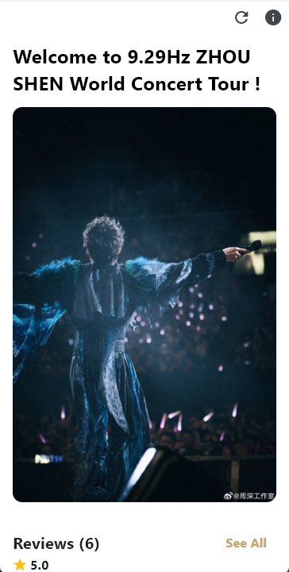
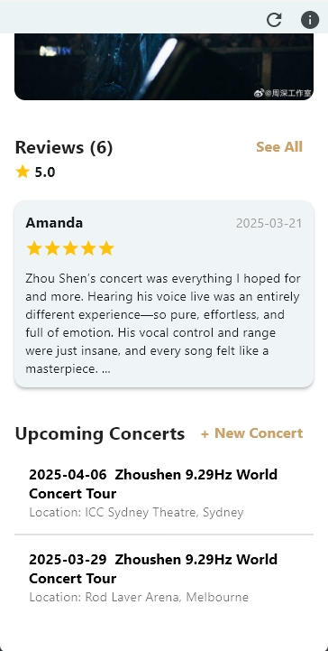
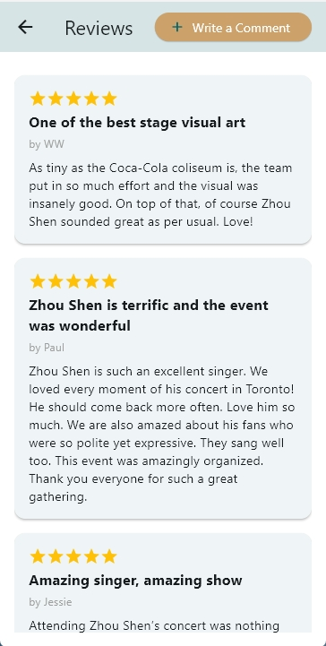
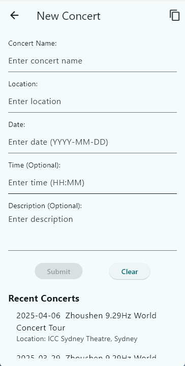

# 🎤 9.29Hz World Tour Concert App

A **Flutter-based concert management and review app** tailored for my favourite singer. Users can browse upcoming concerts, leave reviews, and store all data locally for offline access.

---

## 📱 Features

- 🗓 View upcoming concert events
- ➕ Add, edit, or delete concert information
- 📝 Submit user reviews with rating, title, content, and name
- 🌟 Display latest review and calculate average rating
- 💾 Store data using **Floor** (local SQLite DB)
- 🔐 Persist user input using **flutter_secure_storage**
- 🖼 Randomized welcome image on refresh

---

## 🛠 Tech Stack

- **Flutter 3.x**
- **Dart**
- **Floor (SQLite ORM)**
- **Flutter Secure Storage**
- **Material 3 UI Design**

---

## 📦 Installation

```bash
# Clone the repo
git clone https://github.com/your-username/your-repo-name.git

# Navigate into the directory
cd your-repo-name

# Install dependencies
flutter pub get

# Run the app
flutter run
```

---

📸 Screenshots
### 🏠 Home Page



### 📝 Review Submission


### 🎫 Add Concert


---

## 📄 License

- This project is intended for learning and demo purposes only. Commercial use or redistribution is not allowed.
- All photos displayed in the app are sourced from the official Weibo account of Zhou Shen Studio. Copyright belongs to Zhou Shen Studio.

